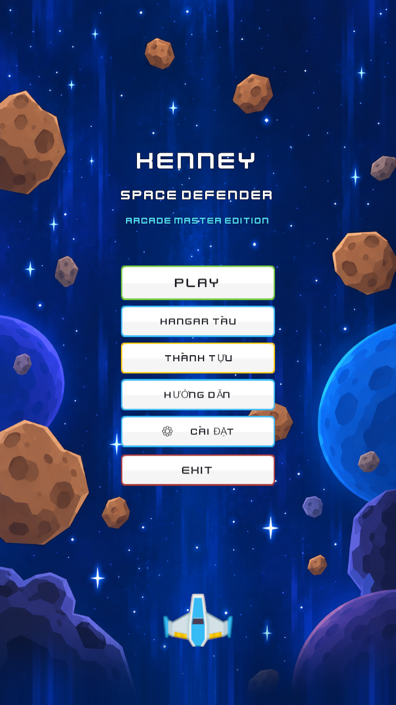
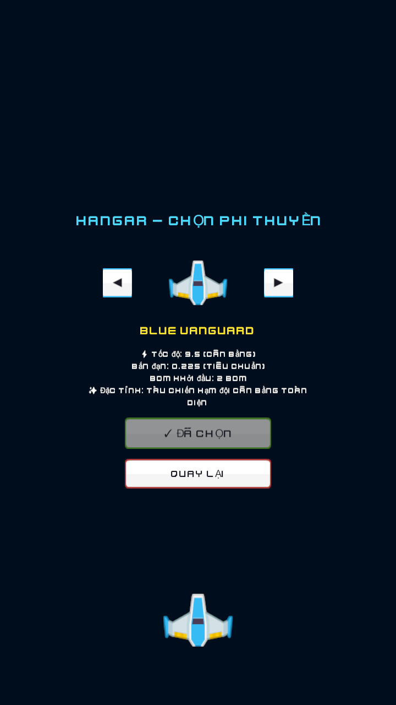
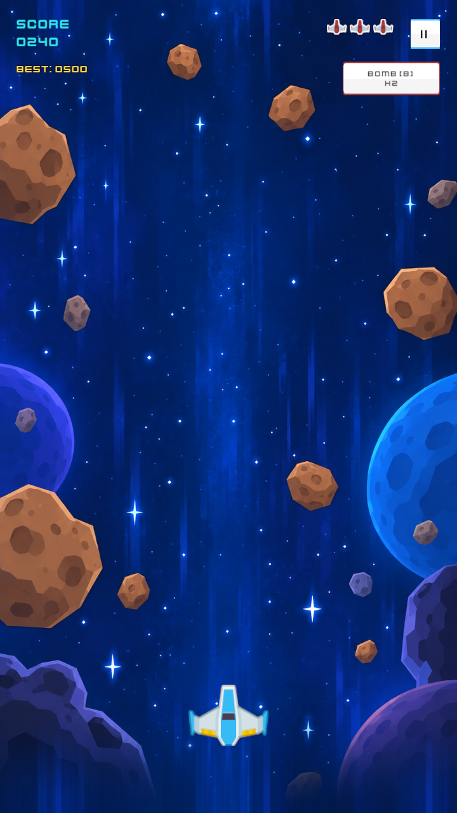
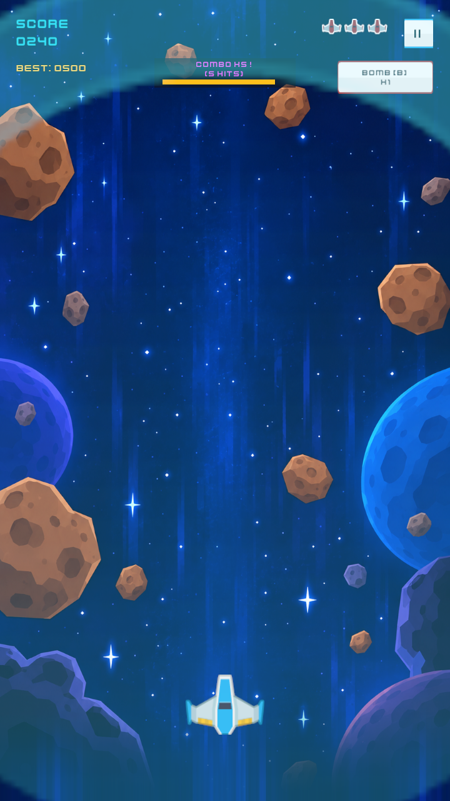
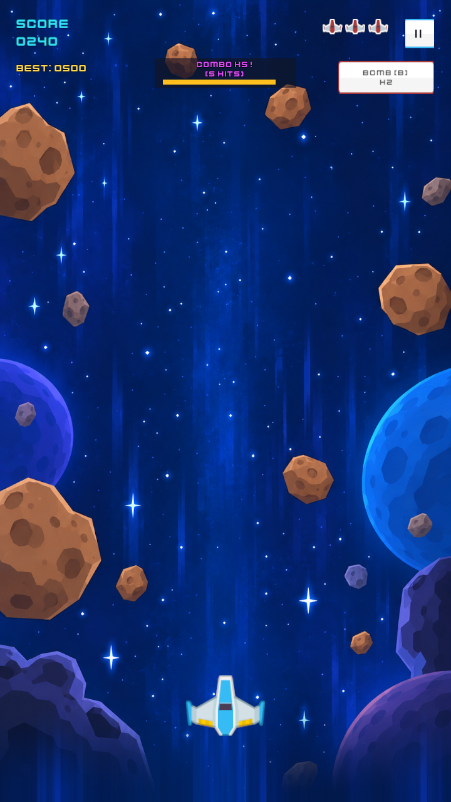
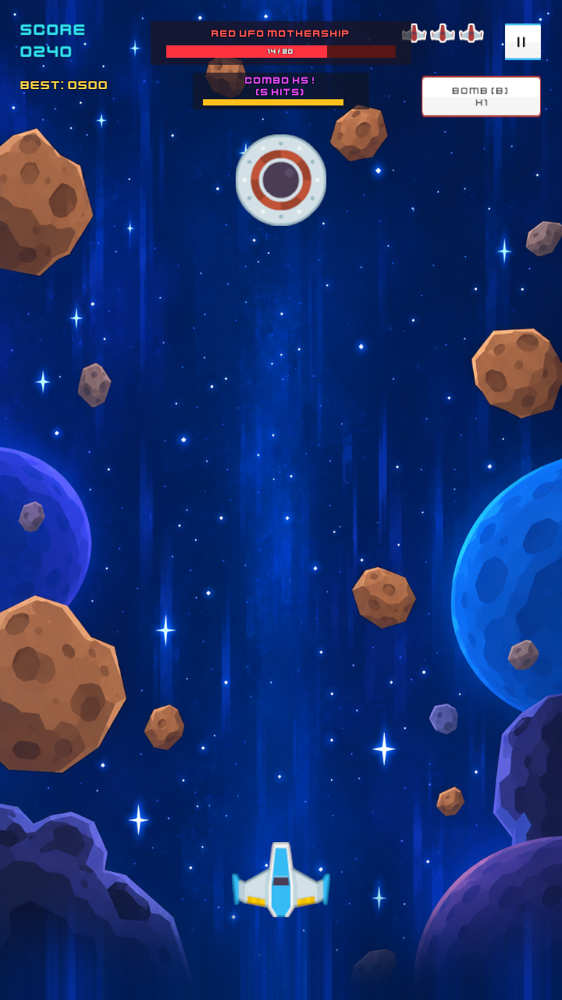
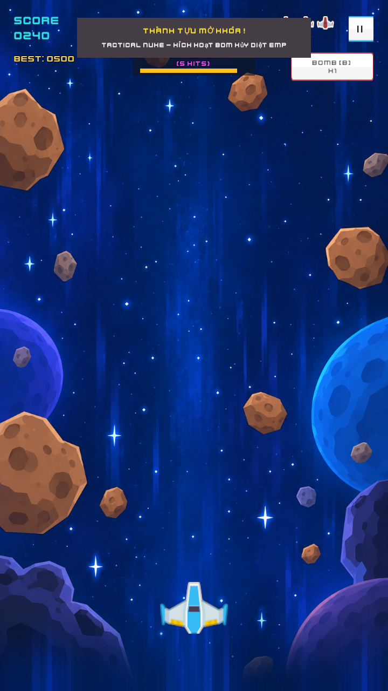
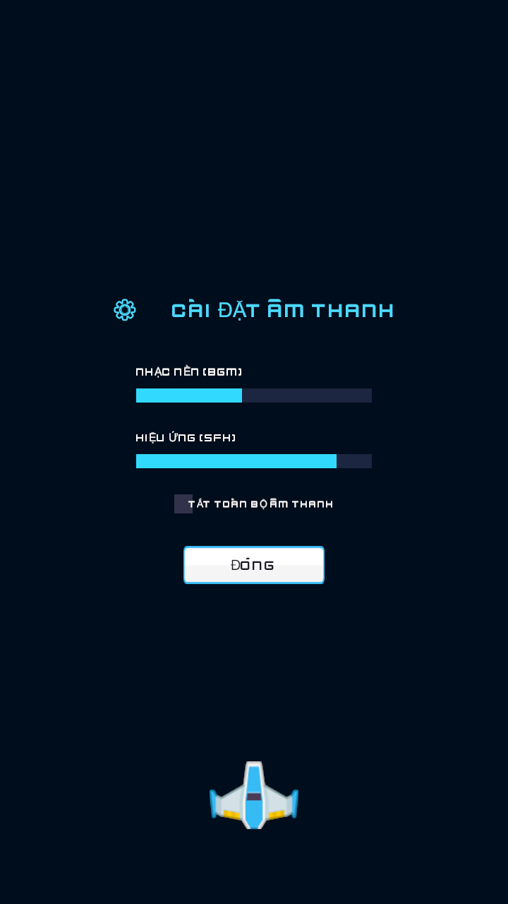

# 🚀 Space Defender

A high-performance 2D retro arcade space shooter game built with **Unity 6 (6000.6.0f1)** and **Universal Render Pipeline (URP 2D)**, featuring the CC0 asset suite by [Kenney](https://kenney.nl/assets/space-shooter-remastered).

---

## 📸 Visual Showcase

| Main Menu & Arcade UI | Ship Hangar Selection |
| :---: | :---: |
|  |  |

| In-Game Combat & HUD | EMP Shockwave Detonation |
| :---: | :---: |
|  |  |

| 5x Combo Multiplier | Red UFO Mothership Boss Battle |
| :---: | :---: |
|  |  |

| Achievement Notification | Audio Settings Modal |
| :---: | :---: |
|  |  |

---

## 🌟 Key Features

### 1. 🚀 Ship Hangar & Archetypes
Select your combat spacecraft directly from the Main Menu Hangar:
- **Blue Vanguard:** Balanced speed (9.5) and fire rate (0.22s) with 2 initial bombs.
- **Orange Interceptor:** Supersonic thrusters (12.0 speed) for agile evasive maneuvers with 1 initial bomb.
- **Green Striker:** Rapid-fire plasma cannons (0.16s rate) with 2 initial bombs.
- **Red Dreadnought:** Heavy combat armor (8.2 speed) equipped with an initial **Energy Shield** and 3 initial bombs.

### 2. 💣 Tactical EMP Nuke Bomb
- Detonate screen-clearing EMP shockwaves by pressing **B**, **Right-Click**, or tapping the **BOMB [B]** HUD button.
- Expands radially to instantly obliterate standard enemy fighters and projectile lasers while inflicting heavy damage (8 HP) to the UFO Boss.
- Features screen shake and custom synthesized sound effects.

### 3. 🔥 Combo Streak & Multiplier System
- Eliminating hostiles within 2.2 seconds builds your combo meter from **x1** up to **x5**.
- Dynamic top-center HUD bar displays current streak, multiplier text, and countdown timer.
- Color-coded floating damage scores reward aggressive arcade play.

### 4. 🛸 Red UFO Mothership Mini-Boss
- Summons dynamically once crossing score thresholds (80+ points).
- Dedicated top-screen **Boss HP Bar** (20 HP) with real-time health updates.
- Employs horizontal sinusoidal flight patterns while firing spread salvos of enemy laser fire.
- Yields massive point rewards and guaranteed power-up drops upon defeat.

### 5. ⚡ Power-Up & Defensive Systems
- **Triple Shot:** Tri-directional spread laser fire lasting 10 seconds.
- **Energy Shield:** Absorbs an entire incoming projectile or collision hit without losing a life heart.
- **Health Restore:** Restores +1 Life Heart (up to 3 maximum lives).
- Temporary invulnerability invincibility flashing after taking damage.

### 6. 🏆 Achievement & Toast System
Features 7 unlockable achievements tracked via `PlayerPrefs`:
- **First Blood:** Destroy your first enemy ship.
- **Iron Wall:** Deploy an Energy Shield barrier.
- **Overcharged:** Activate Triple Shot plasma cannons.
- **Tactical Nuke:** Detonate an EMP Shockwave Bomb.
- **Combo Master:** Reach a 5x Combo Streak.
- **Boss Slayer:** Defeat the Red UFO Mothership.
- **Star Veteran:** Score 200 or more points in a single match.
- Real-time in-game banner toasts notify players of unlocks, and an Achievements modal provides full progress inspection.

### 7. ⚙️ Audio Settings Modal
- Independent volume control sliders for **BGM (Music)** and **SFX (Sound Effects)**.
- Master **Mute All Audio** toggle.
- Settings persist across game sessions via `PlayerPrefs`.
- Accessible from both the Main Menu and In-Game Pause Menu.

### 8. 🌌 Seamless Background Scrolling & VFX
- Endless starfield background scrolling with zero visible seams or stutter.
- Particle systems for thruster jet trails and explosive fragment bursts.

---

## 🕹️ Controls Guide

| Action | Primary Input | Secondary Input |
| :--- | :--- | :--- |
| **Move Ship 2D** | `W` `A` `S` `D` / Arrows | Left Stick / D-Pad (Gamepad) |
| **Fire Blasters** | `Spacebar` / Left Click | `RT` / `A` (Gamepad + Haptics) |
| **Tactical Dash (i-frame)**| `Left Shift` | `LB` / `B` (Gamepad) |
| **Deploy EMP Nuke Bomb** | `B` / Right Click | `Y` / `RB` (Gamepad) |
| **Pause / Resume** | `Escape` / `P` | `Start` (Gamepad) |
| **Restart Game** | `R` (Game Over) | `A` / `Start` (Gamepad) |

---

## 🛠️ Architecture & Technology Stack

- **Engine:** Unity 6 (6000.6.0f1)
- **Render Pipeline:** Universal Render Pipeline (URP 2D) with Post-Processing Bloom & Vignette
- **Input System:** Unity New Input System (`com.unity.inputsystem`) with Gamepad Dual-Motor Haptics
- **Audio:** Multi-channel AudioSource pool with 132 BPM Synthwave & 66 BPM Ambient Pad generator
- **UI Architecture:** Modular Partial Classes with Dirty-Flag Caching & Responsive Canvas
- **Codebase Navigation:** Xem chi tiết cấu trúc phân vùng code tại [Assets/DIRECTORY_MAP.md](Assets/DIRECTORY_MAP.md)
- **Assets:** [Kenney Space Shooter Remastered (CC0)](https://kenney.nl/assets/space-shooter-remastered)

---

## 🚀 Running the Project

### Standalone Executable (Windows 64-bit)
A pre-compiled standalone binary is included in the repository:
```bash
Builds/Windows/SpaceDefender.exe
```
Double-click `SpaceDefender.exe` to play immediately without opening Unity.

### In Unity Editor
1. Clone the repository:
   ```bash
   git clone https://github.com/tuandnb04/Space-Defender.git
   ```
2. Open Unity Hub and add the project folder (Unity 6000.6.0f1 recommended).
3. Open the main scene: `Assets/Scenes/SampleScene.unity`.
4. Press the **Play** button in the Unity Editor toolbar.
